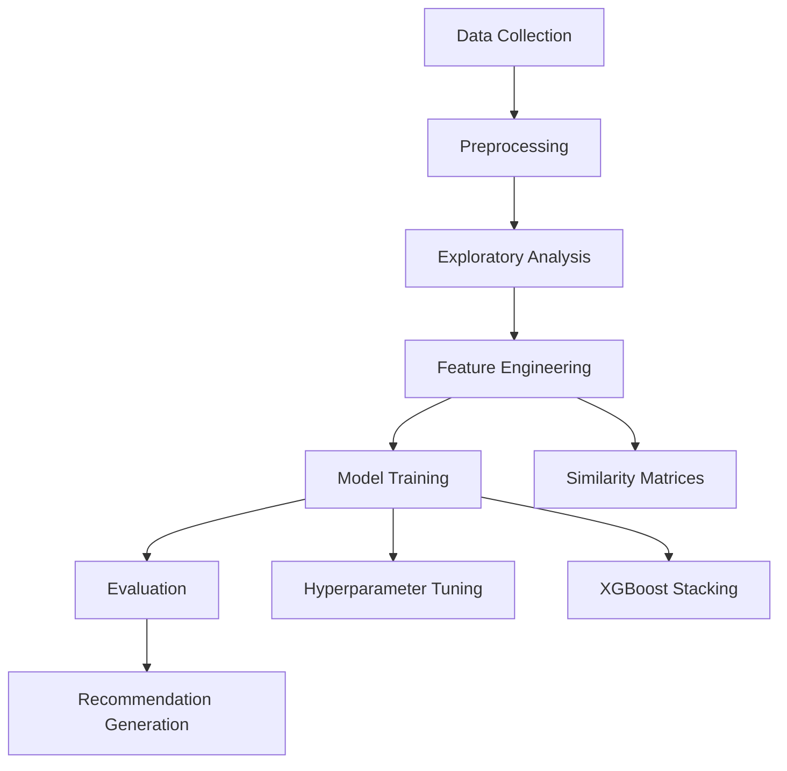

# 🎥 Movie Recommendation System Documentation

Welcome to the **Movie Recommendation System** notebook! This document provides a comprehensive walkthrough of the code, its structure, and how it interacts with data and libraries to build a collaborative filtering–based recommender.  

---

## 📑 Table of Contents

1. [🎯 Business Objective](#business-objective)  
2. [📊 Data Collection](#data-collection)  
3. [🛠️ Environment & Dependencies](#environment)  
4. [🔄 Data Preparation & Preprocessing](#data-preparation)  
5. [📈 Exploratory Data Analysis (EDA)](#eda)  
6. [🚀 Feature Engineering](#feature-engineering)  
7. [🤖 Modeling & Evaluation](#modeling-evaluation)  
8. [🎬 Recommendation Generation](#recommendation-generation)  
9. [🔗 Relationships & Data Flow](#relationships)  
10. [🗺️ Pipeline Diagram](#pipeline-diagram)  

---

<a name="business-objective"></a>
## 1. 🎯 Business Objective

- **Problem**: Users face choice overload on entertainment platforms.  
- **Goal**: Build a **Collaborative Filtering** system to:
  1. Predict the rating a user would give an unseen movie.  
  2. Recommend top-N movies per user.  
  3. Minimize error metrics: **RMSE** & **MAPE**.  

---

<a name="data-collection"></a>
## 2. 📊 Data Collection

- **Source**: MovieLens 20M dataset from GroupLens.  
- **Files Used**:
  - `ratings.csv` – 20M 5-star ratings by ~138K users on 27K movies.  
  - `movies.csv` – Movie metadata (ID, title, genres).  
- **Access**: Mounted via Google Drive path:  
  ```bash
  /content/drive/MyDrive/Colab Datasets/Movie Recommendation/
  ```
  
---

<a name="environment"></a>
## 3. 🛠️ Environment & Dependencies

```python
import os, random, gc
from datetime import datetime

import numpy as np
import pandas as pd
import matplotlib.pyplot as plt
import seaborn as sns

from scipy import sparse
from sklearn.metrics import mean_squared_error
from sklearn.metrics.pairwise import cosine_similarity

import xgboost as xgb
from surprise import (
    Reader, Dataset, BaselineOnly, KNNBaseline,
    SlopeOne, SVD, SVDpp, GridSearchCV
)
from fuzzywuzzy import fuzz, process
```

Package installs (Colab):
```bash
!pip install fuzzywuzzy
!pip install scikit-surprise
```

---

<a name="data-preparation"></a>
## 4. 🔄 Data Preparation & Preprocessing

1. **Load CSVs**  
   ```python
   movie_ratings = pd.read_csv(file_path + "/ratings.csv")
   movies        = pd.read_csv(file_path + "/movies.csv")
   ```
2. **Reindex Movie IDs**  
   Create `newId` to compress ID range:
   ```python
   movies["newId"] = range(1, movies.movieId.nunique()+1)
   movie_ratings["timestamp"] = movie_ratings.timestamp.apply(
       lambda x: datetime.utcfromtimestamp(x).strftime("%Y-%m-%d")
   )
   # Merge & rename
   movie_ratings = movie_ratings.merge(movies, on="movieId")
   movie_ratings.rename(columns={"timestamp":"date"}, inplace=True)
   movie_ratings.movieId = movie_ratings.newId
   movies.movieId        = movies.newId
   movie_ratings.drop("newId", axis=1, inplace=True)
   movies.drop("newId", axis=1, inplace=True)
   ```
3. **Sort & Reset**  
   ```python
   movie_ratings.sort_values("date", inplace=True)
   movie_ratings.reset_index(drop=True, inplace=True)
   ```

---

<a name="eda"></a>
## 5. 📈 Exploratory Data Analysis (EDA)

- **Unique Counts**:
  - Users: ~138 K  
  - Movies: ~27 K  
  - Dates: ~7 K  
- **Rating Distribution**:
  - Ratings ∈ [0.5, 5.0], left-skewed toward 3–5 stars.  
  - Visualized via `sns.countplot("rating", ...)`.  
- **Temporal Insights**:
  - First rating: 1995-01-09  
  - Peak activity: 2000-11-20 (~92 K ratings).  
- **Cold-Start Observations**:
  - ~19% of users & ~54% of movies missing in training split.

---

<a name="feature-engineering"></a>
## 6. 🚀 Feature Engineering

### 6.1 Train/Test Split
```python
# 80/20 time-based split
Train_Data = movie_ratings.iloc[:int(len(movie_ratings)*0.8)]
Test_Data  = movie_ratings.iloc[int(len(movie_ratings)*0.8):]
```

### 6.2 Sparse Matrices
- **User-Item** (`TrainUISparseData`, `TestUISparseData`)
  ```python
  TrainUISparseData = sparse.csr_matrix(
      (Train_Data.rating, (Train_Data.userId, Train_Data.movieId))
  )
  ```
- **Sparsity**: > 99% empty.

### 6.3 Average Ratings
```python
def getAverageRatings(mat, for_user=True):
    axis = 1 if for_user else 0
    sums = mat.sum(axis=axis).A1
    counts = (mat != 0).sum(axis=axis).A1
    return sums/counts
user_avgs  = getAverageRatings(TrainUISparseData, True)
movie_avgs = getAverageRatings(TrainUISparseData, False)
global_avg = movie_ratings.rating.mean()
```

### 6.4 Similarity Matrices
- **Item-Item** via cosine on transpose:
  ```python
  m_m_similarity = cosine_similarity(
      TrainUISparseData.T, dense_output=False
  )
  sparse.save_npz(file_path+"/m_m_similarity.npz", m_m_similarity)
  ```
- **Function** to fetch top-N similars:
  ```python
  def GetSimilarMoviesUsingMovieMovieSimilarity(name, k):
      matches = process.extract(name, movies.title, scorer=fuzz.partial_ratio)
      movie_id = movies.iloc[matches[0][2]].movieId
      sims = np.argsort(-m_m_similarity[movie_id].toarray().ravel())
      top_ids = sims[:k+1]
      df = movies[movies.movieId.isin(top_ids)].copy()
      df["order"] = df.movieId.apply(lambda x: list(top_ids).index(x))
      return df.sort_values("order")
  ```
---

<a name="modeling-evaluation"></a>
## 7. 🤖 Modeling & Evaluation

### 7.1 Error Metrics & Helpers
```python
def get_ratings(preds):
    actual = np.array([p.r_ui for p in preds])
    est    = np.array([p.est for p in preds])
    return actual, est

def error_metrics(y_true, y_pred):
    rmse = np.sqrt(mean_squared_error(y_true, y_pred))
    mape = np.mean(np.abs((y_true - y_pred)/y_true))*100
    return rmse, mape
```

### 7.2 Surprise Algorithms
- **Wrapper** for training & evaluation:
  ```python
  def run_surprise(algo, trainset, testset, name):
      algo.fit(trainset)
      # Train performance
      tr_preds = algo.test(trainset.build_testset())
      tr_rmse, tr_mape = error_metrics(*get_ratings(tr_preds))
      # Test performance
      ts_preds = algo.test(testset)
      ts_rmse, ts_mape = error_metrics(*get_ratings(ts_preds))
      return {"RMSE":tr_rmse,"MAPE":tr_mape,"Pred":tr_preds}, {"RMSE":ts_rmse,"MAPE":ts_mape,"Pred":ts_preds}
  ```
- **Models**:
  - `BaselineOnly` (SGD biases)
  - `KNNBaseline` (user/item)
  - `SlopeOne`
  - `SVD` (matrix factorization)
  - `SVDpp` (with implicit feedback)
  - **Hyperparameter tuning** via `GridSearchCV` on `n_factors`, `lr_all`.

### 7.3 XGBoost Stacking
- **Features**: Predictions from Surprise models  
- **Regressor**: `xgb.XGBRegressor(n_estimators=100)`

### 7.4 Evaluation Summary

| Model              | Train RMSE | Test RMSE | Train MAPE (%) | Test MAPE (%) |
|--------------------|------------|-----------|----------------|---------------|
| BaselineOnly       | 0.8274     | 0.9996    | 27.61          | 36.47         |
| KNNBaseline_User   | 0.3378     | 0.9995    | …              | …             |
| KNNBaseline_Item   | 0.2742     | 0.9995    | …              | …             |
| SlopeOne           | 0.7606     | 0.9991    | …              | …             |
| SVD                | 0.8311     | 0.9995    | 28.10          | 36.46         |
| SVDpp              | 0.7631     | 0.9995    | 25.42          | 36.45         |
| XGB_BSL_KNN_MF_SO  | 1.0665     | 0.9981    | 38.52          | 36.54         |

---

<a name="recommendation-generation"></a>
## 8. 🎬 Recommendation Generation

1. **Top-N Extraction**  
   ```python
   from collections import defaultdict
   def Get_top_n(predictions, n=10):
       top_n = defaultdict(list)
       for uid, mid, true_r, est, _ in predictions:
           top_n[uid].append((mid, est))
       for uid, ratings in top_n.items():
           ratings.sort(key=lambda x: x[1], reverse=True)
           top_n[uid] = ratings[:n]
       return top_n
   ```
2. **Merge with Metadata**  
   ```python
   def Generate_Recommendated_Movies(u_id, n=10):
       df = pd.DataFrame(top_n[u_id], columns=["Movie_Id","Pred"])
       df = df.merge(movies, left_on="Movie_Id", right_on="movieId")
       return df[["Movie_Id","title","genres","Pred"]].head(n)
   ```
3. **Sample Output**  
   ```
   The user Id is :  55237
      Movie_Id                title                        genres  Pred
   0       893   Apartment, The (1960)   Comedy|Drama|Romance   4.34
   1      2850    Lady Eve, The (1941)   Comedy|Romance         4.29
   …  
   ```

---

<a name="relationships"></a>
## 9. 🔗 Relationships & Data Flow

- **Data Files**  
  - `ratings.csv` ↔ DataFrame `movie_ratings`  
  - `movies.csv`  ↔ DataFrame `movies`  
- **Sparse Matrices** stored as `.npz` for fast reload:
  - `TrainUISparseData.npz`, `TestUISparseData.npz`
  - `m_m_similarity.npz`  
- **Libraries**  
  - **Surprise** for CF algorithms  
  - **XGBoost** for stacking  
  - **FuzzyWuzzy** for string matching in item-item recommendations  

---

<a name="pipeline-diagram"></a>
## 10. 🗺️ Pipeline Diagram



---

> **Enjoy exploring and extending this Movie Recommendation System!**
